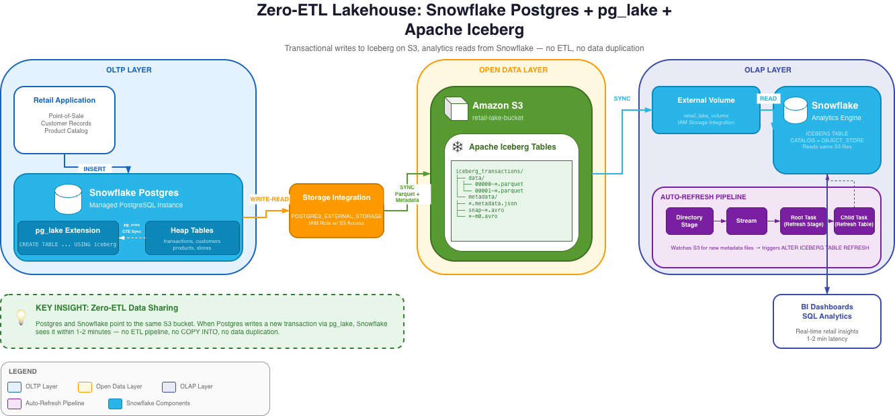

> **Project Status:** This architecture post is complete. Implementation code and a link
> to the full GitHub repo will be added upon project completion. The tool comparisons,
> architecture walkthrough, and code patterns are ready to use as a reference now.

## Stack at a Glance

| Layer | Tool |
|---|---|
| Transactional DB | Snowflake Postgres + pg_lake |
| Table Format | Apache Iceberg |
| Object Storage | Amazon S3 |
| Analytics Engine | Snowflake |
| Refresh Pipeline | Directory Stages + Streams + Tasks |
| Data Simulator | Python (psycopg2) |

---

## The Problem With Traditional OLTP-to-OLAP Pipelines

Most data stacks have a gap between the transactional database and the analytics warehouse.
Your application writes to Postgres, and separately, an ETL job extracts that data,
transforms it, and loads it into Snowflake. This works, but it comes with real costs:

- **Latency** — your analytics are always behind by however often the ETL runs
- **Cost** — you're paying to store the same data twice (Postgres + Snowflake)
- **Complexity** — you now have pipeline infrastructure to maintain, monitor, and debug
- **Drift** — subtle differences between extraction logic and source data cause inconsistencies

If you've read my [Real-Time Banking CDC Pipeline post](/blog/banking-cdc-pipeline), you
know I've built the Kafka + Debezium version of this pattern. This post is the other side
of that coin — what the same CDC problem looks like when you stay entirely within the
Snowflake ecosystem and trade operational complexity for managed simplicity.

The lakehouse pattern attempts to solve the duplication problem by using a single open
data layer — Apache Iceberg on object storage — that both OLTP and OLAP systems can read
from directly. The challenge has always been: how do you get a transactional database like
Postgres to write to Iceberg natively?

This is exactly what **pg_lake** solves.

> **Cost Note:** The Snowflake Connector for PostgreSQL bills per table replicated and can
> accumulate credits quickly at the default sync frequency of every 5 minutes. If you're
> following along, immediately run
> `CALL ENABLE_SCHEDULED_REPLICATION('PSQLDS1', '360 MINUTE')` to set 6-hour syncs during
> development, and monitor your credit usage in Snowsight closely.

---

## What We're Building

A retail transaction system where:

- **Snowflake Postgres** handles all transactional writes (point-of-sale data, customer
  records, product catalog)
- **pg_lake** (a Postgres extension) writes that data as **Apache Iceberg tables on S3**
  automatically
- **Snowflake** reads those exact same Iceberg files for analytics — no data movement,
  no ETL



The key insight: Postgres and Snowflake are both pointing at the same S3 bucket. There is
no ETL step in between. When Postgres writes a new transaction, Snowflake sees it within
1-2 minutes without any pipeline running.

---

## Architecture Deep Dive

### Layer 1: Snowflake Postgres + pg_lake

Snowflake Postgres is a managed PostgreSQL instance that runs inside the Snowflake
platform. It's fully compatible with standard Postgres, so existing Postgres drivers,
ORMs, and tools work without modification.

**pg_lake** is a Postgres extension that adds a new table type: `USING iceberg`. When you
create a table with this syntax, every write to that table is automatically serialized as
Parquet files in Iceberg format on S3. The extension handles the Iceberg metadata —
manifest files, snapshot tracking — so that the S3 data is always in a valid, queryable
Iceberg state.

```sql
-- Standard Postgres heap table (fast transactional writes)
CREATE TABLE transactions (
    txn_id         SERIAL PRIMARY KEY,
    store_id       INT NOT NULL,
    customer_id    INT,
    total_amount   NUMERIC(12,2),
    synced_at      TIMESTAMP
);

-- pg_lake Iceberg table (writes Parquet directly to S3)
CREATE TABLE iceberg_transactions (
    txn_id         INT,
    store_id       INT,
    customer_id    INT,
    total_amount   NUMERIC(12,2),
    synced_at      TIMESTAMP
) USING iceberg;
```

The architecture uses two table types in tandem. The heap table handles fast transactional
writes. A pg_cron job then syncs unprocessed rows to the Iceberg table using an atomic
CTE pattern:

```sql
-- Atomic sync: insert new rows to Iceberg, mark as synced — all in one statement
WITH synced AS (
    INSERT INTO iceberg_transactions
    SELECT txn_id, store_id, customer_id, total_amount, now()
    FROM transactions WHERE synced_at IS NULL
    RETURNING txn_id
)
UPDATE transactions
SET synced_at = now()
WHERE txn_id IN (SELECT txn_id FROM synced);
```

This CTE pattern is important — it ensures rows are never double-synced and the sync
remains atomic even if interrupted halfway through.

### Layer 2: AWS S3 + IAM

S3 is the neutral ground between Postgres and Snowflake. Both access it through the same
IAM role, configured to trust multiple Snowflake principals. One gotcha: Snowflake requires
a separate storage integration for the Postgres instance (`POSTGRES_EXTERNAL_STORAGE`) and
another for the Snowflake query engine (`EXTERNAL_STAGE`). The IAM trust policy ends up
needing to allow three separate IAM user ARNs — one for pg_lake writes, one for the
external volume reads, and one for directory stage refreshes. Missing any one of these
causes silent failures that are frustrating to debug.

### Layer 3: Snowflake Iceberg Tables + Auto-Refresh

On the Snowflake side, you create Iceberg tables pointing to the same S3 metadata files
pg_lake writes. Since pg_lake manages the Iceberg catalog, not Snowflake, you use
`CATALOG = OBJECT_STORE` — Snowflake reads Iceberg metadata directly from S3 rather than
from Glue or its own catalog.

```sql
CREATE OR REPLACE ICEBERG TABLE iceberg_transactions
  EXTERNAL_VOLUME = 'retail_lake_volume'
  CATALOG = 'pg_lake_catalog'
  METADATA_FILE_PATH = 'frompg/tables/postgres/public/iceberg_transactions/<OID>/metadata/<FILE>.metadata.json';
```

Because `AUTO_REFRESH` only works with external catalogs (not OBJECT_STORE), you build a
refresh pipeline using Snowflake-native components:

```
Directory Stage → Stream → Root Task (refresh stage) → Child Task (refresh Iceberg table)
```

The directory stage watches the S3 metadata folder for new files. The stream detects when
new files appear. The task chain fires when the stream has data, calling a stored procedure
that finds the latest metadata file and runs `ALTER ICEBERG TABLE ... REFRESH`. This gives
you near-real-time refresh without polling on a fixed schedule.

---

## What pg_lake Teaches You About Iceberg Internals

One of the most educational parts of this project was seeing how Iceberg works under the
hood, because pg_lake makes the metadata structure visible on S3:

```
s3://your-bucket/frompg/tables/postgres/public/iceberg_transactions/<OID>/
  ├── data/
  │   ├── 00000-<uuid>.parquet    ← actual row data
  │   └── 00001-<uuid>.parquet
  └── metadata/
      ├── 00000-<uuid>.metadata.json   ← table snapshot
      ├── snap-<id>-<uuid>.avro        ← manifest list
      └── <uuid>-m0.avro               ← manifest file
```

Every write creates a new **snapshot** — a point-in-time view of which data files are
valid. The metadata JSON file points to a manifest list, which points to manifest files,
which point to the actual Parquet data files. This chain is what enables time travel and
atomic operations. Understanding this structure explains exactly why the Snowflake
auto-refresh works the way it does: it's just reading the latest `.metadata.json` file
and following the chain down to the Parquet.

---

## Tool Comparison: pg_lake vs. Kafka + Debezium CDC

I've built both approaches, so this comparison comes from direct experience rather than
just reading the docs.

| Approach | pg_lake + Iceberg | Kafka + Debezium CDC |
|---|---|---|
| Infrastructure overhead | Low (managed by Snowflake) | High (Kafka cluster, Debezium, connectors) |
| Latency | 1-2 minutes | Sub-second to seconds |
| Cost | Snowflake Postgres credits | Kafka infrastructure + engineering time |
| Open format |  Iceberg (any engine can read) | Depends on sink — Snowflake sink is proprietary |
| Schema evolution | Handled by pg_lake | Requires Schema Registry (Avro/Protobuf) |
| Operational complexity | Low | High |
| Vendor lock-in | Snowflake ecosystem | Confluent / Kafka ecosystem |
| Best for | Analytics freshness of 1-2 min, minimal ops | Sub-second freshness, complex event routing |

The honest tradeoff is **latency vs. operational flexibility**. If you need sub-second
freshness — fraud detection, real-time dashboards — Kafka + Debezium is still the right
answer. If 1-2 minute freshness works for your analytics and you want to minimize
operational overhead, the pg_lake approach is significantly simpler to run in production.

The underrated advantage of pg_lake: **Iceberg is truly open**. If you later want to
query that same data from Trino, Spark, or DuckDB, you can — without moving data again.
Most Kafka CDC sink pipelines write to Snowflake-proprietary storage, which means
you'd need another ETL step to use any other engine.

---

## Tool Comparison: Snowflake Postgres vs. Standard RDS Postgres

Worth clarifying what Snowflake Postgres is and isn't:

| Feature | Snowflake Postgres | AWS RDS Postgres |
|---|---|---|
| pg_lake (Iceberg writes) |  Available |  Not available |
| Snowflake-native auth |  Yes |  No |
| Standard Postgres compatibility |  Full |  Full |
| Direct S3 integration |  Via storage integration | Via extensions (less seamless) |
| Cost model | Snowflake credits | RDS instance hours |

If you're already using Snowflake as your analytics warehouse, Snowflake Postgres + pg_lake
is a compelling way to eliminate the ETL layer for transactional data. If you're not on
Snowflake, the traditional approach — RDS + Debezium + Kafka — is still the standard.

---

## What I'd Do Differently

**Use Snowpipe for the auto-refresh instead of tasks.** Snowpipe can be triggered by S3
event notifications, making the refresh truly event-driven rather than polling-based. This
would reduce the 1-2 minute lag significantly for high-write-volume tables.

**Separate the IAM roles for read and write.** The current setup uses a single IAM role
for both pg_lake writes and Snowflake reads. In production these should be separate roles,
following the principle of least privilege.

**Add a schema compatibility check before refresh.** When pg_lake writes a new Iceberg
snapshot after a schema change in Postgres, Snowflake needs to refresh with updated
metadata. Without a check, schema changes can cause silent query failures on the
Snowflake side.

---

## Key Takeaways

**Zero-ETL is real, but has tradeoffs.** Eliminating the ETL pipeline means accepting
managed infrastructure and slightly higher latency than Kafka-based CDC. For most analytics
use cases, that tradeoff is worth it.

**Iceberg's metadata structure is what makes this work.** Because Iceberg is a
self-describing open format, any engine that understands the spec can read it — no
proprietary format negotiation. This is why pg_lake (Postgres) and Snowflake can share
the same files without any middleware.

**Snowflake Tasks are underrated.** The auto-refresh pipeline — directory stages, streams,
tasks — is entirely serverless, with no Airflow, no Lambda, no external scheduler. For
Snowflake-native workflows, this is the right tool for lightweight orchestration.

---

## Resources

- [Snowflake Developer Guide: Build a Lakehouse with pg_lake](https://www.snowflake.com/en/developers/guides/build-a-lakehouse-with-snowflake-postgres-and-pg-lake/)
- [pg_lake Documentation](https://docs.snowflake.com/en/LIMITEDACCESS/postgres-pg_lake)
- [Apache Iceberg Table Spec](https://iceberg.apache.org/spec/)
- [Snowflake Iceberg Tables](https://docs.snowflake.com/en/user-guide/tables-iceberg)
- [Snowflake Streams documentation](https://docs.snowflake.com/en/user-guide/streams-intro)